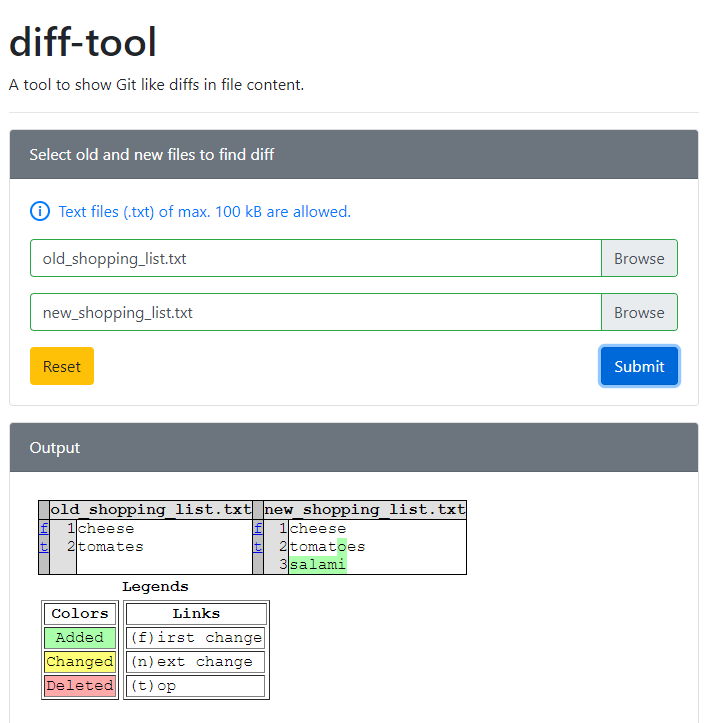

# diff-tool

A tool to show Git like file diffs on command line or in HTML format.

## Getting Started

### Install dependencies

- [Apache](https://httpd.apache.org/) or [Ngnix](https://www.nginx.com/) is required to run the web server.
- [PHP](https://www.php.net/) is required to run backend code. PHP extension `fileinfo` needs to be enabled in `php.ini`.
- [Python3](https://www.python.org/) is required to run *diff-tool* core functionality, based on `difflib` python package which comes with Python.

### Clone repository

```shell script
cd /var/www/html/
sudo git clone https://github.com/hamza1886/diff-tool.git
cd diff-tool/
```

### Adjust directory permissions

Adjust directory permissions to allow file upload to work

```shell script
sudo chmod -R 777 upload/
```

### Adjust apache config

Open Apache config.

```shell script
sudo nano /etc/apache2/sites-enabled/000-default.conf
```

Add following config to `000-default.conf`.

```apacheconfig
# root web directory
DocumentRoot /var/www/html/diff-tool

# allow all files and directories
<Directory /var/www/html/diff-tool>
        AllowOverride All
</Directory>

# deny access to directories starting with dot (.) like .git
<Directory ~ "/\.(?!well-known\/)">
        Order deny,allow
        Deny from all
</Directory>
```

Restart apache to work with new config.

```shell script
sudo systemctl restart apache2
```

### Run *diff-tool* web app

Visit `http://<domain.com|ip_address>/index.html` in browser.

**Output**



## License

The *diff-tool* is open-source software licensed under the MIT [license](LICENSE).
